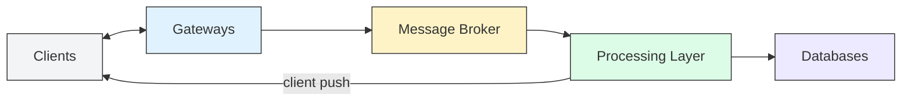

```mermaid


flowchart LR
    A[Clients] <--> B[Gateways]
    B --> C[Message Broker]
    C --> D[Processing Layer]
    D --> E[Databases]
    D -->|client push| A

    style A fill:#f3f4f6,stroke:#333,stroke-width:1px
    style B fill:#e0f2fe,stroke:#333,stroke-width:1px
    style C fill:#fef3c7,stroke:#333,stroke-width:1px
    style D fill:#dcfce7,stroke:#333,stroke-width:1px
    style E fill:#ede9fe,stroke:#333,stroke-width:1px
```
