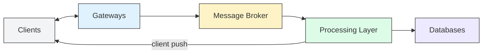

A messaging service project to allow me to learn high-performance
and throughput computing, complex architectures and building at
scale.

### Components

###### Client

The client will probably be a CLI TUI

###### Database

ScyllaDB

###### Message Broker

NATS!

###### Gateways

These will sit between cleints and the message brokers. They will
handle incoming connections, do auth, rate limiting and
validation. These will then forward the messages to the broker
(kafka). Will probably write this in Go or Elixir

###### Processing layer

Where the real work happens after the broker. It consumes the
messages from broker, persists them to DB (ScyllaDB), deliver
real-time pushes to connected users. Also maybe run extra logic
like moderation, analytics, etc. Either in Go or elixir
