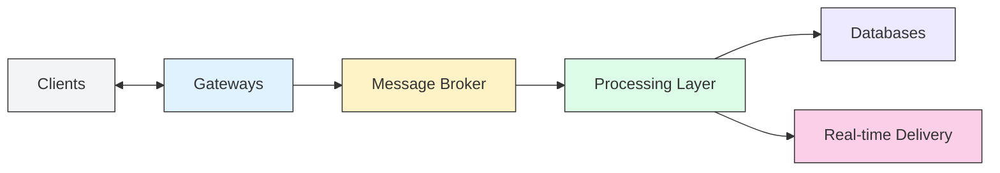

```mermaid
flowchart LR
    A[Clients] <--> B[Gateways]
    B --> C[Message Broker]
    C --> D[Processing Layer]
    D --> E[Databases]

    D --> F[Real-time Delivery]

    style A fill:#f3f4f6,stroke:#333,stroke-width:1px
    style B fill:#e0f2fe,stroke:#333,stroke-width:1px
    style C fill:#fef3c7,stroke:#333,stroke-width:1px
    style D fill:#dcfce7,stroke:#333,stroke-width:1px
    style E fill:#ede9fe,stroke:#333,stroke-width:1px
    style F fill:#fbcfe8,stroke:#333,stroke-width:1px

```
